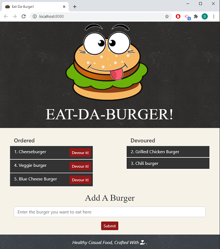

# 13-Burger

:construction: IN PROGRESS  :construction:  

---

 <a href="https://img.shields.io/badge/node-v12.19.0-orange?style=plastic"></a>
<a href="https://img.shields.io/badge/express-v4.16.4-red?style=plastic"></a>
<a href="https://img.shields.io/badge/npm-MySQL-blue?style=plastic"></a>
<a href="https://img.shields.io/badge/npm-express--handlebars-blue?style=plastic"></a>
<a href="https://img.shields.io/badge/heroku-v7.47.11-yellow?style=plastic"></a>
 <a href="https://img.shields.io/badge/License-MIT-brightgreen?style=plastic"></a>  

---

## Table of Contents  
* [Description](#Description)
* [User Story and Details](#User-Story-and-Details)  
* [Installation and Usage](#Installation-and-Usage)  
* [Images of the app](#Images-of-the-app-) 
* [Credits](#Credits) 
* [License](#License)  
* [Contact](#Contact) 


## Description  

This restaurant app lets users input the names of burgers they'd like to eat. It uses [Node](https://nodejs.org/en/), [Express](https://www.npmjs.com/package/express), [MySQL](https://www.npmjs.com/package/mysql),  [Handlebars](https://www.npmjs.com/package/express-handlebars) and [Heroku](https://dashboard.heroku.com/apps) for deployment. It also uses ORM technique and follows the MVC design pattern. 


## User Story and Details

```
User Story Acceptance Criteria
```
```
AS a burger fan, 
I want to be able to submit a burger's name that I really liked it,  
SO that the burger is displayed on waiting area, on the left side of the page.
WHEN a burger is in the waiting area, it has a `Devour it!` button,
SO other users can click on it. 
WHEN I click on a `Devour it!` button,
the burger will move to the right side of the page.
WHEN I submit a burger's name, 
it will be saved in the app's database, devoured or not
```

:information_source:  

 Under a `db` folder, a file `schema.sql`does the following:
   * Create the `burgers_db`.
   * Switch to or use the `burgers_db`.
   * Create a `burgers` table with these fields:  
     * **id** - INT PRIMARY KEY autoincrementing  
     * **burger_name** - a string for the burger's name  
     * **devoured** - a boolean  

Another file `seeds.sql` writes insert queries to populate the `burgers` table with at least three entries.  

 `schema.sql` and `seeds.sql` should be run from CLI into the mysql server.  

:warning:   TO DO

## Installation and Usage  
- You can run the Heroku deployed app directly by clicking on this [link](TO DO). 

- To install without using the deployed app, follow the below steps: 
    - Open a terminal instance  
    - Clone the following [repo](https://github.com/Delph-Sunny/burger)  
    - In the working directory, install the dependencies package with the following code line `npm i`  


    -   :warning:   TO DO
  

## Images of the App :mag:  

Launched app:  
 

:movie_camera: The full movie showing the functionality of the application can be found [here](https://youtu.be/msvdn95x9OM). 
  
## Credits  
 
Photo by Hermes Rivera from [www.Unsplash.com](https://www.Unsplash.com/)  
Icon made by Freepik from [www.flaticon.com](https://www.flaticon.com/)  


## License  

Copyright (c) 2021 DT. This project is [MIT](https://choosealicense.com/licenses/mit) licensed.

## Contact  

:octocat:  GitHub: [Delphine](https://github.com/Delph-Sunny)  


---